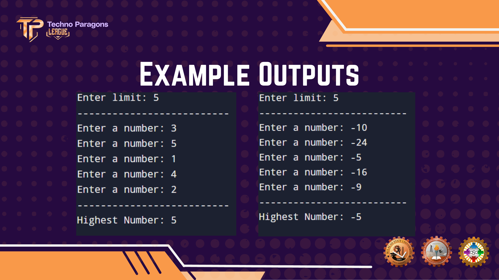
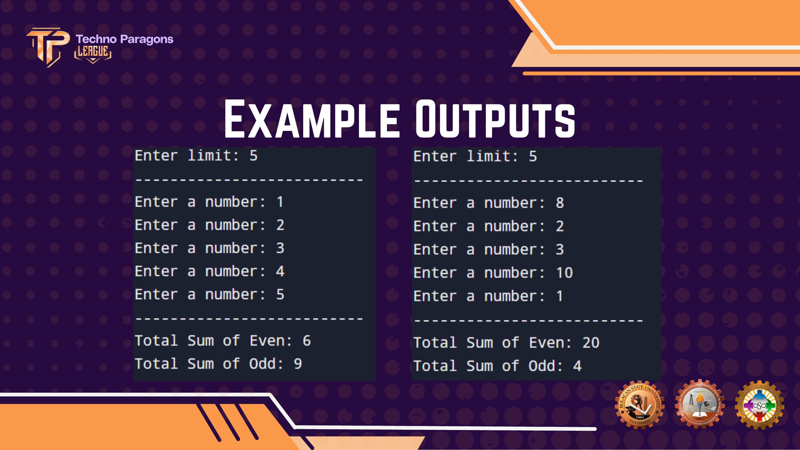
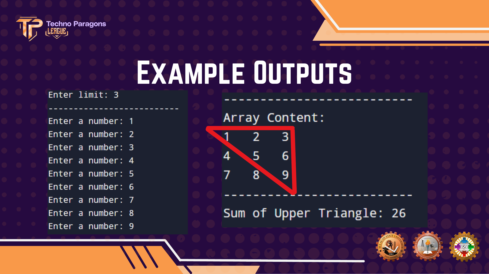
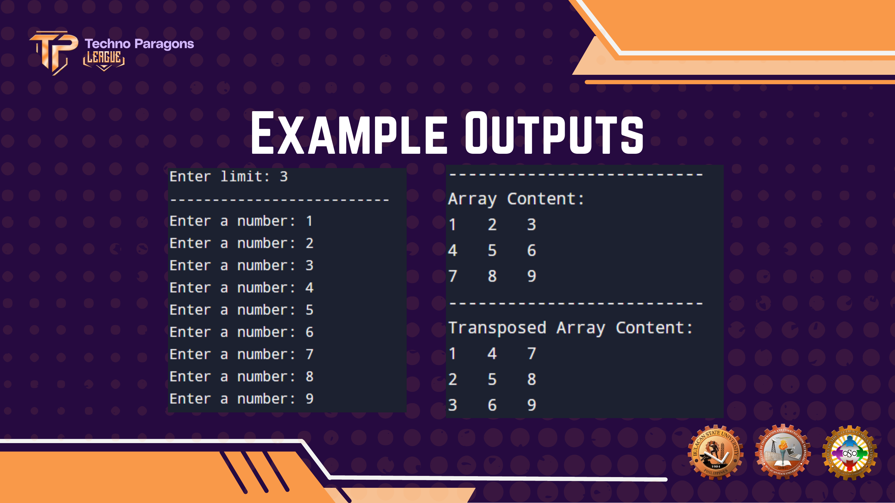
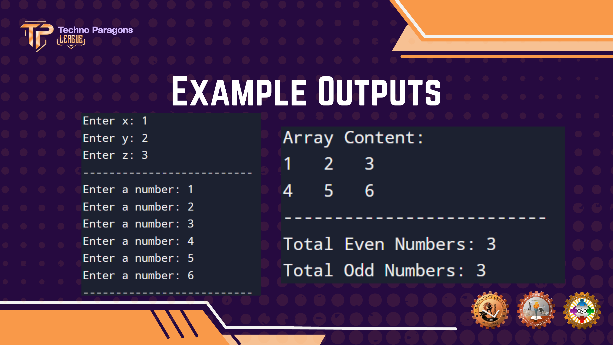
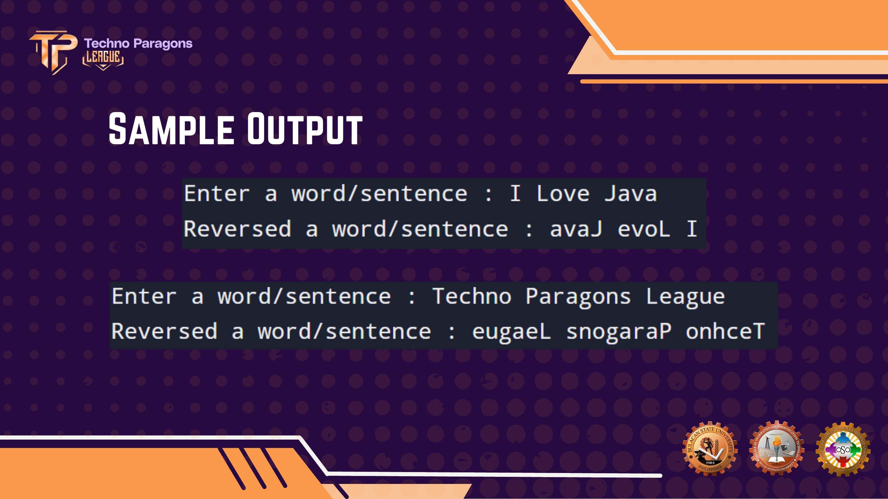
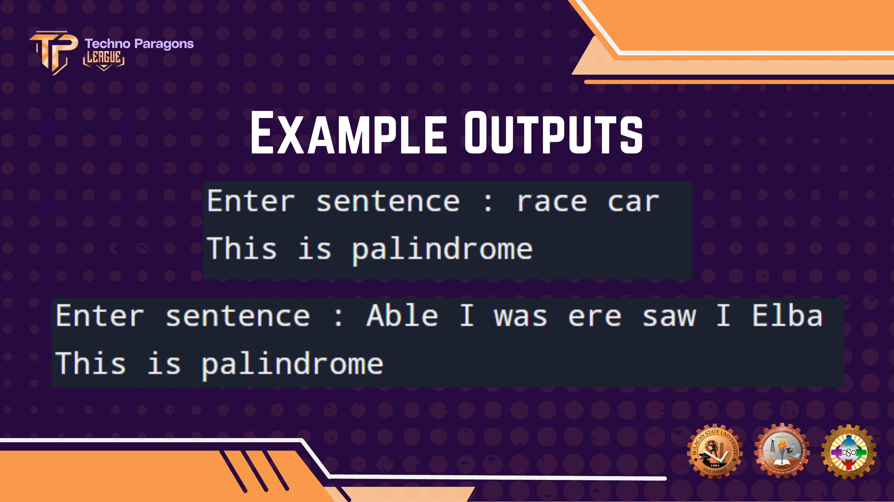
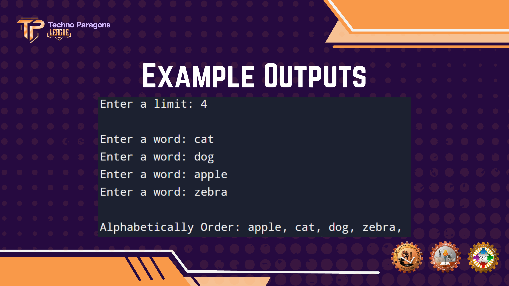
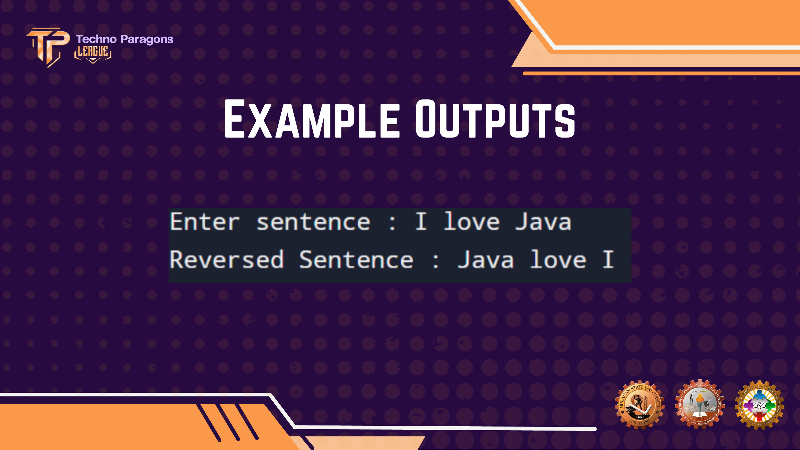

# SPARKS: Comprog Exercises and Activities

---

## [Array 1D Highest](./Highest.java)

Write a Java program that ask the user to enter the limit of an array and inputs a quantity of number based on the limit. Display the highest inputted number.

---

## [Array 1D Even and Odd](./EvenOdd.java)

Write a Java program that ask the user to enter the limit of an array and inputs a quantity of number based on the limit. Display the sum of even and odd numbers inside of the array.

---

## [Array 2D Triangle](./Triangle.java)

Write a Java program that ask the user to enter the limit of an array and inputs a quantity of number based on the limit. Display the sum of the upper triangle.

---

## [Array 2D Transposed](./Transposed.java)

Write a Java program that ask the user to enter the limit of an array and inputs a quantity of number based on the limit. Display the transposed array.

---

## [Array 3D Even and Odd](./EvenOddThree.java)

Write a Java program that ask the user to enter the x, y and z of an array. Display the total quantity of even and odd numbers.

---

## [String Methods Reversed](./Reversed.java)

Create a Java program that prompts the user to input a word or a string, and then outputs the reversed version of the input string.

---

## [String Methods Palindrome](./Palindrome.java)

Write a Java program that ask the user to input a word or sentence. Check if the input is a palindrome or not.

---

## [String Methods Alphabetical](./Alphabetical.java)

Write a Java program that ask the user to input a limit and number of words based on the limit. Display the contents of the array alphabetically.

---

## [String Methods Reversed Order](./ReversedOrder.java)

Write a program that takes a sentence and reverses the order of words.

